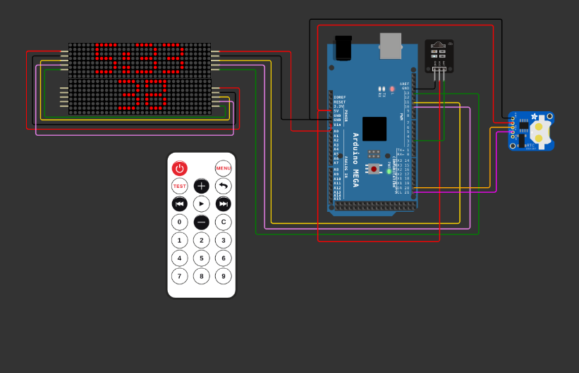

# arduino-remote-clock
A real time and countdown clock that can control remotely(IR Remote).
### Components
> Arduino Mega  
> RTC DS1307  
> IR_Reciever 
> IR Remote 
> MAX_72xx Dot Matrix Display (2x4)

## Simulation  

